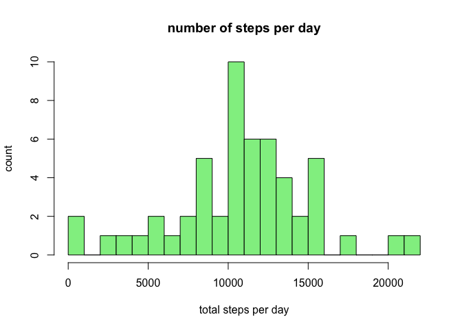
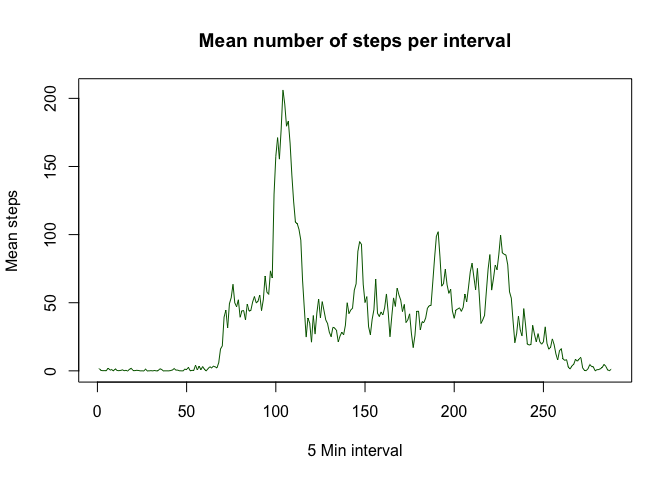
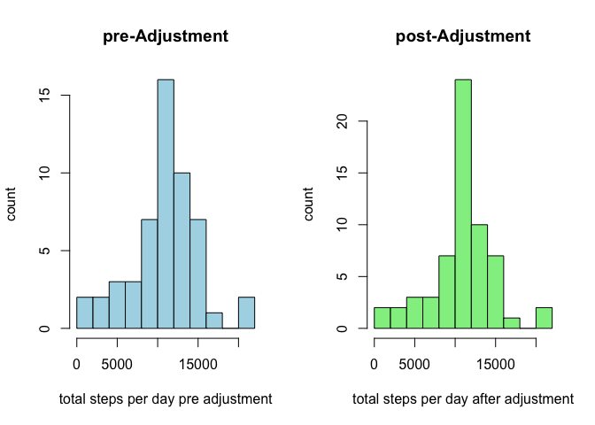
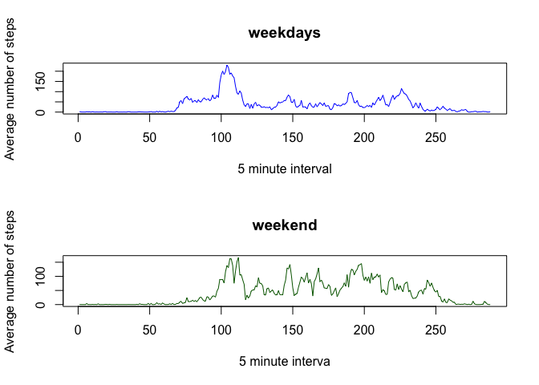

# Reproducible Research: Peer Assessment 1

## Loading and preprocessing the data
1. Set the Working Directory and Check if the activity.csv file is present:

```r
WorkingDir <- "~/RStudioWD/RepData_PA1/"
Data <- "actvity.csv"
zipFile <- "activity.zip"
setwd(WorkingDir)

if(!file.exists(Data)){
  if(!file.exists(zipFile)){
    download.file("https://d396qusza40orc.cloudfront.net/repdata%2Fdata%2Factivity.zip", destfile = "~/RStudioWD//RepData_PA1/",method = "curl")
    unzip(zipFile)
  } else {
    unzip(zipFile)
  }
}
```

2. Read the activity file onto a data variable in R to process and analyze it.

```r
DF <- read.csv("activity.csv")
DF$date <- as.Date(DF$date)
summary(DF)
```

```
##      steps             date               interval     
##  Min.   :  0.00   Min.   :2012-10-01   Min.   :   0.0  
##  1st Qu.:  0.00   1st Qu.:2012-10-16   1st Qu.: 588.8  
##  Median :  0.00   Median :2012-10-31   Median :1177.5  
##  Mean   : 37.38   Mean   :2012-10-31   Mean   :1177.5  
##  3rd Qu.: 12.00   3rd Qu.:2012-11-15   3rd Qu.:1766.2  
##  Max.   :806.00   Max.   :2012-11-30   Max.   :2355.0  
##  NA's   :2304
```

```r
head(DF)
```

```
##   steps       date interval
## 1    NA 2012-10-01        0
## 2    NA 2012-10-01        5
## 3    NA 2012-10-01       10
## 4    NA 2012-10-01       15
## 5    NA 2012-10-01       20
## 6    NA 2012-10-01       25
```

## What is mean total number of steps taken per day?

1. Total number of steps take each day?


```r
uniqueDates <- factor(DF$date)
dailySteps <- tapply(DF$steps, uniqueDates, sum,rm.na =T)

hist(dailySteps,xlab = "total steps per day",ylab = "count", main = "number of steps per day", breaks = 20, col = "light green")
```

 

2. The calculated **Mean** is and **Median** are:


```r
mean(dailySteps,na.rm = T)
```

```
## [1] 10767.19
```

```r
median(dailySteps, na.rm = T)
```

```
## [1] 10766
```
## What is the average daily activity pattern?
1. Average daily steps:


```r
intervals <- factor(DF$interval)
intervalMeans <- tapply(DF$steps, intervals, mean, na.rm = T)
plot(intervalMeans,xlab = "5 Min interval",ylab = "Mean steps", main = "Mean number of steps per interval", type = "l", col = "dark Green")
```

 

2. Maximum number of steps was 206.17 steps in the 104'th interval:

```r
maxStep <- max(intervalMeans)
maxStep
```

```
## [1] 206.1698
```

```r
maxStepInterval <- which(intervalMeans == maxStep)
maxStepInterval
```

```
## 835 
## 104
```
## Imputing missing values

1. What are the number of rows with missing data:


```r
isna <- is.na(DF$steps)
sum(isna)
```

```
## [1] 2304
```

2.  Subsitute missing values with 5min interval avarage for that period:

###Pre and Post Adjustment of intervals with na values, with that 5-min interval mean.


```r
uniqueDates <- factor(DF$date)
dailySteps <- tapply(DF$steps, uniqueDates, sum,rm.na =T)

intervalMeanDF <- as.data.frame(intervalMeans)
dataset2 = merge(DF,intervalMeanDF,by.x="interval",by.y = "row.names")
dataset2$steps[is.na(dataset2$steps)] = dataset2$intervalMeans[is.na(dataset2$steps)]
uniqueDates2 <- factor(dataset2$date)
dailySteps2 <- tapply(dataset2$steps, uniqueDates2, sum)

par(mfrow = c(1,2))
hist(dailySteps,xlab = "total steps per day pre adjustment",ylab = "count", main = "pre-Adjustment", breaks = 15, col = "light blue")
hist(dailySteps2,xlab = "total steps per day after adjustment",ylab = "count", main = "post-Adjustment", breaks = 15, col = "light green")
mtext("Steps adjusted for na values to 5-min interval mean for corrisponing interval mean",outer = TRUE)
```

 

## Are there differences in activity patterns between weekdays and weekends?


```r
dataset2$day <- weekdays(dataset2$date)
dataset2$day[dataset2$day == "Saturday" | dataset2$day == "Sunday" ] <- "weekend"
dataset2$day[dataset2$day == "Monday" | dataset2$day == "Tuesday" | dataset2$day == "Wednesday"| dataset2$day == "Thursday" | dataset2$day == "Friday" ] <- "weekday"

Average_StepsByInterval_Weekday =  tapply(subset(dataset2, day=="weekday")$steps, subset(dataset2, day=="weekday")$interval, mean, na.rm=TRUE)
Average_StepsByInterval_Weekend =  tapply(subset(dataset2, day=="weekend")$steps, subset(dataset2, day=="weekend")$interval, mean, na.rm=TRUE)

par(mfrow = c(2, 1))
plot(Average_StepsByInterval_Weekday, type="l", xlab="5 minute interval", ylab="Average number of steps", main="weekdays", col = "blue")
plot(Average_StepsByInterval_Weekend, type="l", xlab="5 minute interva", ylab="Average number of steps", main="weekend", col = "dark green")
```

 
